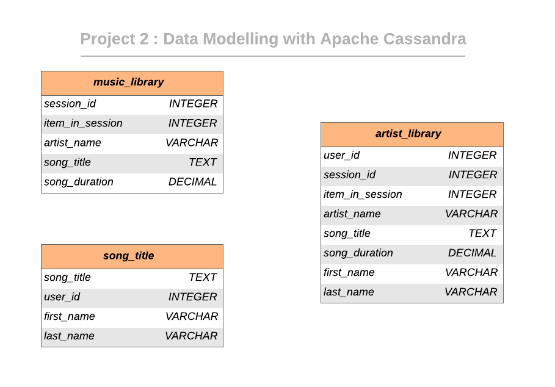

  [![Contributors][contributors-shield]][contributors-url] [![Forks][forks-shield]][forks-url] [![Stargazers][stars-shield]][stars-url] [![Issues][issues-shield]][issues-url] [![MIT License][license-shield]][license-url] [![LinkedIn][linkedin-shield]][linkedin-url]

<!-- PROJECT LOGO -->
<br />

<p align="center">
 <a href="https://github.com/vineeths96/Data-Engineering-Nanodegree">
  
 </a>
 <h3 align="center">Data Modeling ETL with Apache Cassandra</h3>
 <p align="center">
  Udacity Nanodegree Course Project 2
  <br />
  <a href=https://github.com/vineeths96/Data-Engineering-Nanodegree><strong>Explore the repository»</strong></a>
  <br />
  <br />
 </p>


</p>

> apache, cassandra, nosql, data engineering, ETL, data modeling


<!-- ABOUT THE PROJECT -->

## About The Project

A startup called Sparkify wants to analyze the data they've been collecting on songs and user activity on their new music streaming application. The analytics team is particularly interested in understanding what songs users are listening to. Currently, they don't have an easy way to query their data, which resides in a directory of JSON logs on user activity on the application, as well as a directory with JSON meta-data on the songs in their application.

They'd like a data engineer to create a Apache Cassandra database which can create queries on song play data to answer the questions and make meaningful insights. The role of this project is to create a database schema and ETL pipeline for this analysis. 

### Project Description

In this project, we will model the data with Apache Cassandra and build an ETL pipeline using Python. The ETL pipeline transfers data from a set of CSV files within a directory to create a streamlined CSV file to model and insert data into Apache Cassandra tables. We will create separate denormalized tables for answering specific queries, properly using partition keys and clustering columns.

### Built With

* python
* Apache Cassandra
* iPython notebooks

### Dataset

#### Event Dataset

Event dataset is a collection of CSV files containing the information of user activity across a period of time.  Each file in the dataset contains the information regarding the song played, user information and other attributes . 

List of available data columns :

```
artist, auth, firstName, gender, itemInSession, lastName, length, level, location, method, page, registration, sessionId, song, status, ts, userId
```


## Keyspace Schema Design

### Data Model ERD

The keyspace design is shown in the image below. Each table is modeled to answer a specific known query. This model enables to query the database schema containing huge amounts of data. Relational databases are not suitable in this scenario due to the magnitude of data. 



## Project structure

Files in this repository:

|     File / Folder      |                         Description                          |
| :--------------------: | :----------------------------------------------------------: |
|       event_data       | Folder at the root of the project, where all user activity CSVs reside |
|         images         |  Folder at the root of the project, where images are stored  |
| event_datafile_new.csv | Contains the data after merging the CSV files at `event_data` |
|    Project 2.ipynb     | iPython notebook containing the ETL pipeline including data extraction, modeling and loading into the keyspace tables. |
|         README         |                         Readme file                          |


<!-- GETTING STARTED -->

## Getting Started

Clone the repository into a local machine using

```sh
git clone https://github.com/vineeths96/Data-Engineering-Nanodegree
```

### Prerequisites

These are the prerequisites to run the program.

* python 3.7
* Apache Cassandra
* cassandra python library

### How to run

Follow the steps to extract and load the data into the data model.

1. Navigate to `Project 2 Data Modeling with Apache Cassandra` folder
2. Run `Project 2.ipynb` iPython notebook
3. Run Part 1 to create `event_datafile_new.csv` 
4. Run Part 2 to initiate the ETL process and load data into tables 

5. Check whether the data has been loaded into database by executing `SELECT` queries


<!-- LICENSE -->

## License

Distributed under the MIT License. See `LICENSE` for more information.


<!-- CONTACT -->

## Contact

Vineeth S - vs96codes@gmail.com

Project Link: [https://github.com/vineeths96/Data-Engineering-Nanodegree](https://github.com/vineeths96/Data-Engineering-Nanodegree)


<!-- MARKDOWN LINKS & IMAGES -->
<!-- https://www.markdownguide.org/basic-syntax/#reference-style-links -->

[contributors-shield]: https://img.shields.io/github/contributors/vineeths96/Data-Engineering-Nanodegree.svg?style=flat-square
[contributors-url]: https://github.com/vineeths96/Data-Engineering-Nanodegree/graphs/contributors
[forks-shield]: https://img.shields.io/github/forks/vineeths96/Data-Engineering-Nanodegree.svg?style=flat-square
[forks-url]: https://github.com/vineeths96/Data-Engineering-Nanodegree/network/members
[stars-shield]: https://img.shields.io/github/stars/vineeths96/Data-Engineering-Nanodegree.svg?style=flat-square
[stars-url]: https://github.com/vineeths96/Data-Engineering-Nanodegree/stargazers
[issues-shield]: https://img.shields.io/github/issues/vineeths96/Data-Engineering-Nanodegree.svg?style=flat-square
[issues-url]: https://github.com/vineeths96/Data-Engineering-Nanodegree/issues
[license-shield]: https://img.shields.io/badge/License-MIT-yellow.svg
[license-url]: https://github.com/vineeths96/Data-Engineering-Nanodegree/blob/master/LICENSE
[linkedin-shield]: https://img.shields.io/badge/-LinkedIn-black.svg?style=flat-square&logo=linkedin&colorB=555
[linkedin-url]: https://linkedin.com/in/vineeths
[product-screenshot]: images/screenshot.jpg