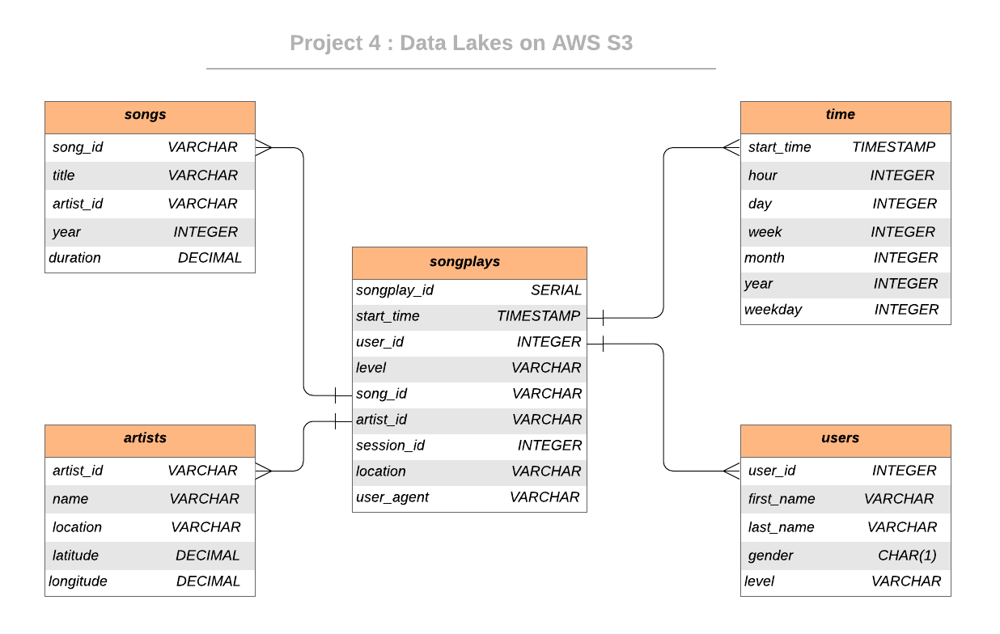

  [![Contributors][contributors-shield]][contributors-url] [![Forks][forks-shield]][forks-url] [![Stargazers][stars-shield]][stars-url] [![Issues][issues-shield]][issues-url] [![MIT License][license-shield]][license-url] [![LinkedIn][linkedin-shield]][linkedin-url]

<!-- PROJECT LOGO -->
<br />

<p align="center">
 <a href="https://github.com/vineeths96/Data-Engineering-Nanodegree">
  
 </a>
 <h3 align="center">Data Lake with AWS S3</h3>
 <p align="center">
  Udacity Nanodegree Course Project 4
  <br />
  <a href=https://github.com/vineeths96/Data-Engineering-Nanodegree><strong>Explore the repository»</strong></a>
  <br />
  <br />
 </p>

</p>

> s3, emr, spark, aws, data lake, data engineering, ETL, ELT 


<!-- ABOUT THE PROJECT -->

## About The Project

A startup called Sparkify wants to analyze the data they've been collecting on songs and user activity on their new music streaming application. Sparkify has grown their user base and song database large and want to move their data warehouse to a data lake. Their data resides in S3, in a directory of JSON logs on user activity on the application, as well as a directory with JSON metadata on the songs in their application.

They'd like a data engineer to build an ETL pipeline that extracts their data from S3,  processes them using Spark, and loads the data back into S3 as a set of fact and dimensional tables. This will allow their analytics team to continue finding insights in what songs their users are listening to. The role of this project is to create a data lake on cloud (AWS S3) and build ETL pipeline for this process. 

### Project Description

In this project, we will build a data lake on AWS S3 and build an ETL pipeline for a data lake hosted on S3. The data is loaded from S3 and processed into analytics tables using Spark and the processed data is loaded back into S3 in the form of parquet files.

### Built With

* python
* AWS

### Dataset

#### Song Dataset

Songs dataset is a subset of [Million Song Dataset](http://millionsongdataset.com/). Each file in the dataset is in JSON format and contains meta-data about a song and the artist of that song. The dataset is hosted at S3 bucket `s3://udacity-dend/song_data`.

Sample Record :

```
{"num_songs": 1, "artist_id": "ARJIE2Y1187B994AB7", "artist_latitude": null, "artist_longitude": null, "artist_location": "", "artist_name": "Line Renaud", "song_id": "SOUPIRU12A6D4FA1E1", "title": "Der Kleine Dompfaff", "duration": 152.92036, "year": 0}
```

#### Log Dataset

Logs dataset is generated by [Event Simulator](https://github.com/Interana/eventsim). These log files in JSON format simulate activity logs from a music streaming application based on specified configurations. The dataset is hosted at S3 bucket `s3://udacity-dend/log_data`.

Sample Record :

```
{"artist": null, "auth": "Logged In", "firstName": "Walter", "gender": "M", "itemInSession": 0, "lastName": "Frye", "length": null, "level": "free", "location": "San Francisco-Oakland-Hayward, CA", "method": "GET","page": "Home", "registration": 1540919166796.0, "sessionId": 38, "song": null, "status": 200, "ts": 1541105830796, "userAgent": "\"Mozilla\/5.0 (Macintosh; Intel Mac OS X 10_9_4) AppleWebKit\/537.36 (KHTML, like Gecko) Chrome\/36.0.1985.143 Safari\/537.36\"", "userId": "39"}
```


## Database Schema Design

### Data Model ERD

The Star Database Schema (Fact and Dimension Schema) is used for data modeling in this ETL pipeline. There is one fact table containing all the metrics (facts) associated to each event (user actions), and four dimensions tables, containing associated information such as user name, artist name, song meta-data etc. This model enables to search the database schema with the minimum number of *SQL JOIN*s possible and enable fast read queries. 

The data stored on S3 buckets is extracted and processed using Spark, and is then inserted into the fact and dimensional tables. This tables are stored back to S3 in parquet files, organized for optimal performance. An entity relationship diagram (ERD) of the data model is given below. 




## Project structure

Files in this repository:

| File / Folder |                         Description                          |
| :-----------: | :----------------------------------------------------------: |
|     data      | Folder at the root of the project, where smaller version of data are stored |
|    images     |  Folder at the root of the project, where images are stored  |
|    etl.py     | Loads and processes the data from S3 and stores them back to S3 |
|    dl.cfg     |              Sample configuration file for AWS               |
|    README     |                         Readme file                          |


<!-- GETTING STARTED -->

## Getting Started

Clone the repository into a local machine using

```sh
git clone https://github.com/vineeths96/Data-Engineering-Nanodegree
```

### Prerequisites

These are the prerequisites to run the program.

* python 3.7
* AWS account
* AWS EMR (preferred, but not necessary)

### How to run

Follow the steps to extract and load the data into the data model.

1. Navigate to `Project 4 Data Lake on AWS` folder

2. Edit the `dl.cfg` configuration file and fill in the AWS Access Key and Secret Key fields

3. Run ETL process by 

   ```python
   python etl.py
   ```

   This will execute the commands corresponding to loading data from S3, processing it using Spark and store them back to S3 in parquet files.

4.  The stored files can be explored in AWS S3.


<!-- LICENSE -->

## License

Distributed under the MIT License. See `LICENSE` for more information.


<!-- CONTACT -->

## Contact

Vineeth S - vs96codes@gmail.com

Project Link: [https://github.com/vineeths96/Data-Engineering-Nanodegree](https://github.com/vineeths96/Data-Engineering-Nanodegree)


<!-- MARKDOWN LINKS & IMAGES -->
<!-- https://www.markdownguide.org/basic-syntax/#reference-style-links -->

[contributors-shield]: https://img.shields.io/github/contributors/vineeths96/Data-Engineering-Nanodegree.svg?style=flat-square
[contributors-url]: https://github.com/vineeths96/Data-Engineering-Nanodegree/graphs/contributors
[forks-shield]: https://img.shields.io/github/forks/vineeths96/Data-Engineering-Nanodegree.svg?style=flat-square
[forks-url]: https://github.com/vineeths96/Data-Engineering-Nanodegree/network/members
[stars-shield]: https://img.shields.io/github/stars/vineeths96/Data-Engineering-Nanodegree.svg?style=flat-square
[stars-url]: https://github.com/vineeths96/Data-Engineering-Nanodegree/stargazers
[issues-shield]: https://img.shields.io/github/issues/vineeths96/Data-Engineering-Nanodegree.svg?style=flat-square
[issues-url]: https://github.com/vineeths96/Data-Engineering-Nanodegree/issues
[license-shield]: https://img.shields.io/badge/License-MIT-yellow.svg
[license-url]: https://github.com/vineeths96/Data-Engineering-Nanodegree/blob/master/LICENSE
[linkedin-shield]: https://img.shields.io/badge/-LinkedIn-black.svg?style=flat-square&logo=linkedin&colorB=555
[linkedin-url]: https://linkedin.com/in/vineeths
[product-screenshot]: images/screenshot.jpg